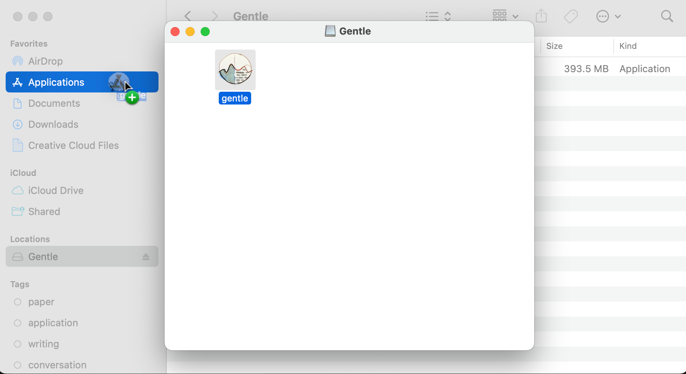
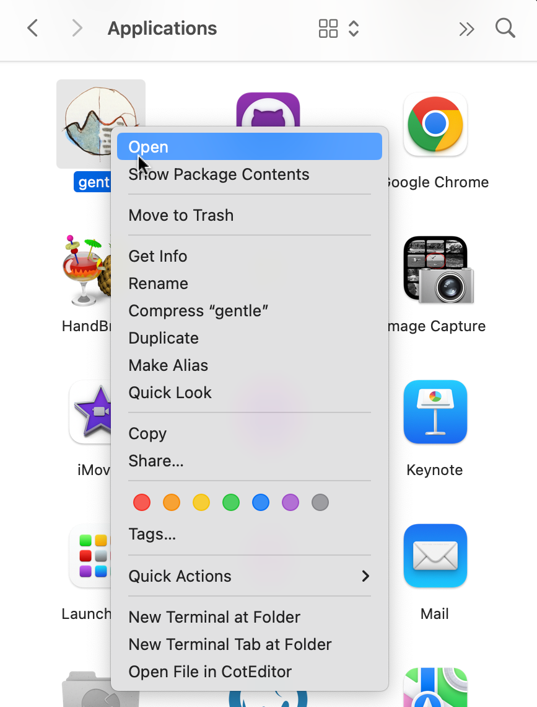
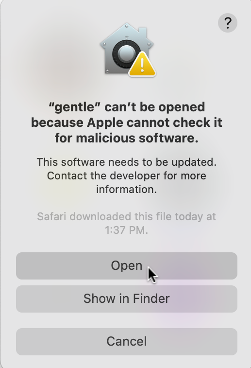
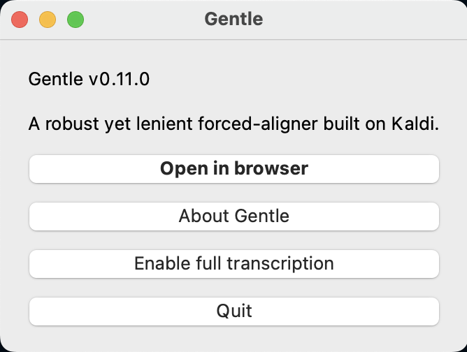
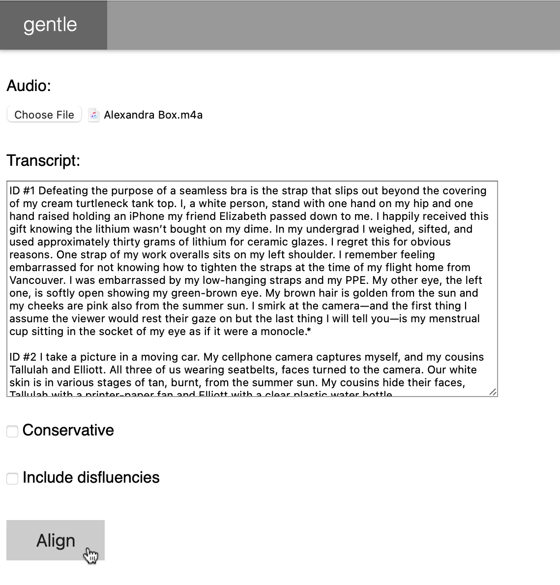
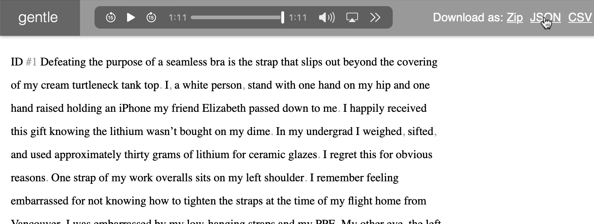
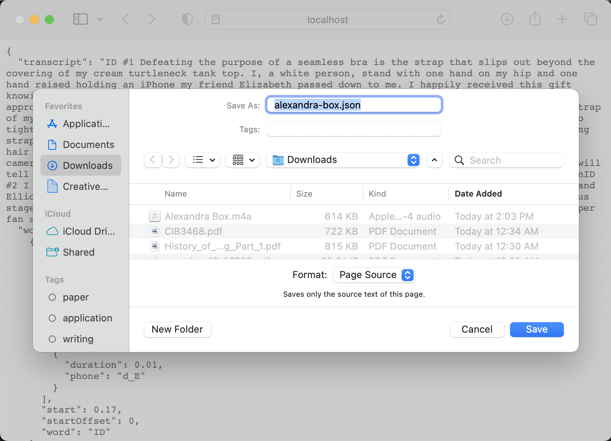
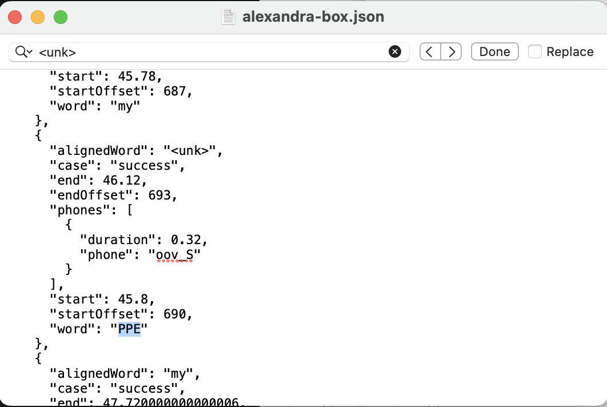

# Selfies with audio

## Upload the audio file
Upload the audio file to a selfie in the CMS. The CMS will save the audio file to the `/assets/sounds` directory in this repository.
Once you click "Publish", you should see a "Listen" button on the selfie's page.

Note: Make sure the audio file is in a commonly supported file format, like `mp3`. Be mindful of the file size too: `mp3` files are generally smaller than `wav` files. Files larger than 10MB may take too long to load on mobile devices.

## Create a transcript file for the audio
When you play a selfie's audio on the website, you may see that the words become highlighted as they are spoken. This is because the audio is synced with a transcript file. The transcript file is a `.json` file that contains the text of the audio, broken down into phrases. Each phrase is associated with a start time and an end time, which tells the website when to highlight the phrase.

The transcript files are generated using a software called [Gentle](http://lowerquality.com/gentle/). Gentle is a software that aligns audio and text. You can download the transcript file from Gentle and upload it to the selfie in the CMS.

### Installing Gentle
1. On the [Gentle homepage](http://lowerquality.com/gentle/), click "Download a DMG" to download it to your computer.
2. Open the DMG file and drag the Gentle icon to your Applications folder.
    
    
3. In your applications folder, Context-click on the Gentle icon and click "Open".
    
    
4. You may see a warning that Apple cannot check it for malicious software. We trust that it's not malicious software, so click "Open" to proceed.

    
5. And there you have it! Gentle is open! You can open it normally from your Applications folder from now on.

    

### Using Gentle
1. **Open Gentle** and click "Open in browser"
2. **Add audio file.** Under "Audio", click "Choose file" and select the audio file you want to transcribe.
3. **Add transcript text.** Under "Transcript", paste the text of the selfie in the box.
4. **Skip checkboxes.** You don't need to check the boxes "Conservative" or "Include disfluencies".
5. **Align.** Click "Align"

    
6. **Wait** for Gentle to align the audio and text. This can take a few minutes.
7. **Test the alignment.** After Gentle is done aligning, play the audio in the bar at the top of the page, to see the text highlight with it.
8. **Download the transcript file as JSON.** 
    1. Next to "Download as", click "JSON".

        
    2. If the JSON file opens in a new tab, simply click "File > Save As..." in your browser. Make sure to set "Format:" to "Page Source" and not "Web Archive". Change the file name to something easier to remember, like the selfie's author, and add the extension `.json`.

        
9. **Clean up transcript file** Sometimes, we need to do a little bit of clean up on the transcript file, but it's very easy. Open the JSON file in a text editor and replace any occurences of `<unk>` with the correct word. Here is an example:
    1. Do a Command+F (Find) for `<unk>` in the JSON file.
        
         in the JSON file" src="images/gentle_9-1.png" width="531"/>
    2. Identify the word from the text transcript that was supposed to be there. It's about 12 lines down from the `<unk>`
        
        
    3. Replace `<unk>` with the correct word.
        
        ` with the correct word" src="images/gentle_9-3.png" width="531"/>

### Uploading the transcript file
1. In the selfie's page in the CMS, click "Choose file" under "Transcript" and select the transcript file that you have downloaded and cleaned up.
2. Upload it and publish!